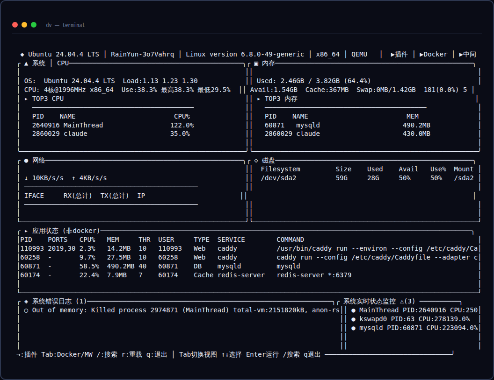

<div align="center">

# dv

**Rust 高性能开发工具箱 | 热插拔插件架构 | CLI / TUI / Web 三端一体**

[](https://github.com/gokeep-projects/dv/actions/workflows/ci.yml)
[](https://github.com/gokeep-projects/dv/releases)
[](LICENSE)
[](https://www.rust-lang.org)

**[功能特性](#功能特性) · [快速安装](#快速安装) · [使用指南](#使用指南) · [插件列表](#插件列表) · [架构设计](#架构设计) · [编译构建](#编译构建)**

</div>

---

## 功能特性

- **三端一体** — CLI 命令行 + TUI 终端 UI + Web 可视化，共享同一套插件
- **热插拔插件** — libloading 动态加载 `.so`/`.dll`，运行时重载无需重启
- **12 个内置插件** — JSON / 加密 / 终端 / 日志搜索 / 服务检测 / 中间件 / 脚本 / Git / HTTP / 文件 / Elasticsearch / 系统信息
- **实时监控面板** — CPU / 内存 / 磁盘 / 网络 / 进程，带异常检测
- **中间件管理** — Redis / Elasticsearch / Kafka / Nginx / Tomcat / Caddy
- **Docker 管理** — 容器生命周期、资源统计、日志、详情
- **跨平台编译** — Linux (x86_64, aarch64) / macOS (Intel, Apple Silicon) / Windows
- **静态二进制** — musl 链接，零外部依赖，离线部署
- **自动发现** — 扫描运行中的中间件服务，自动识别

## 快速安装

### 下载预编译二进制

从 [GitHub Releases](https://github.com/gokeep-projects/dv/releases) 下载：

| 平台 | 架构 | 文件 |
|------|------|------|
| Linux | x86_64 | `devtool-linux-x86_64.tar.gz` |
| Linux | aarch64 | `devtool-linux-aarch64.tar.gz` |
| macOS | x86_64 | `devtool-macos-x86_64.tar.gz` |
| macOS | aarch64 (Apple Silicon) | `devtool-macos-aarch64.tar.gz` |
| Windows | x86_64 | `devtool-windows-x86_64.zip` |

```bash
# Linux x86_64
curl -L https://github.com/gokeep-projects/dv/releases/latest/download/devtool-linux-x86_64.tar.gz | tar xz
chmod +x devtool && sudo mv devtool /usr/local/bin/

# Linux aarch64
curl -L https://github.com/gokeep-projects/dv/releases/latest/download/devtool-linux-aarch64.tar.gz | tar xz
chmod +x devtool && sudo mv devtool /usr/local/bin/

# macOS (Apple Silicon)
curl -L https://github.com/gokeep-projects/dv/releases/latest/download/devtool-macos-aarch64.tar.gz | tar xz
chmod +x devtool && sudo mv devtool /usr/local/bin/
```

### 源码编译

```bash
git clone https://github.com/gokeep-projects/dv.git
cd dv
cargo build --release --bin devtool
```

## 使用指南

### TUI 模式 (交互式终端)

```bash
dv tui
```



**快捷键：**

| 按键 | 功能 |
|------|------|
| `Tab` / `Shift+Tab` | 切换视图 (仪表盘 / 插件 / Docker / 中间件) |
| `↑` / `↓` | 上下选择 |
| `Enter` | 进入 / 执行 |
| `q` | 退出 |
| `/` | 搜索 / 过滤 |
| `F1` | 帮助 |
| `r` | 重载插件 / 刷新数据 |
| `1`-`9` | 中间件快速跳转 |

### Web 模式

```bash
dv web --port 8080 --host 0.0.0.0
```

浏览器打开 `http://localhost:8080`，暗色玻璃拟态主题。

### CLI 模式

```bash
# 列出所有插件
dv list

# 直接执行插件
dv exec json-tool format --input '{"b":2,"a":1}'
dv exec crypto hash --algo sha256 --input "hello"
dv exec crypto base64-encode --input "hello"
dv exec log-search grep --pattern "ERROR" --path /var/log/syslog

# 插件管理
dv plugin reload json-tool
dv plugin load ./path/to/custom.so

# 生成 shell 自动补全
dv completions bash > ~/.bash_completion.d/dv
dv completions zsh > ~/.zfunc/_dv
```

## 插件列表

| 插件 | 快捷键 | 功能说明 |
|------|--------|----------|
| **JSON Tool** | `j` | JSON 格式化、校验、查询 (jq 语法)、对比 |
| **Crypto** | `c` | AES / RSA 加密、Base64、SHA256 / MD5、JWT、HMAC |
| **Terminal** | `t` | Shell 命令执行、PTY 交互 |
| **Log Search** | `l` | 正则搜索、高亮匹配、日志解析 |
| **Service Status** | `s` | HTTP / TCP / 进程健康检查 |
| **Middleware** | `m` | Redis / MySQL / Kafka 连接测试 |
| **Script Runner** | `r` | 嵌入式 Rhai 脚本执行 |
| **Git Tools** | `g` | Git 操作：diff / log / status |
| **HTTP Client** | `h` | HTTP 请求，支持全部方法 |
| **File Tool** | `f` | 文件操作、搜索、监听 |
| **Elasticsearch** | `e` | ES 集群管理、索引操作 |
| **Sysinfo** | `i` | 系统信息采集 |

## 架构设计

```
dv/
├── crates/
│   ├── core/              # 插件 trait、PluginManager、共享类型
│   ├── cli/               # CLI 入口、参数解析
│   ├── tui/               # 终端 UI (ratatui + crossterm)
│   │   ├── app.rs         # 主应用状态、事件循环、渲染
│   │   ├── dashboard.rs   # 系统监控、异常检测
│   │   ├── theme.rs       # 颜色主题
│   │   └── middleware/     # Redis / ES / Kafka / Nginx / Docker 管理
│   ├── web/               # Web 服务 (axum + WebSocket)
│   └── plugins/           # 12 个插件 crate (cdylib)
├── assets/web/            # Web UI (HTML / CSS / JS，rust-embed 嵌入)
├── .github/workflows/     # CI/CD 流水线
└── scripts/               # 构建发布脚本
```

### 插件系统

每个插件是独立的 Rust crate，编译为 `cdylib` 动态库：

```rust
pub trait Plugin: Send + Sync {
    fn metadata(&self) -> PluginMetadata;
    fn execute(&self, input: PluginInput) -> PluginResult<PluginOutput>;
    fn tui_view(&self) -> Option<TuiViewDef>;
    fn web_handlers(&self) -> Vec<WebHandlerDef>;
    fn init(&mut self) -> PluginResult<()>;
    fn shutdown(&mut self);
}
```

运行时从插件目录自动发现加载，支持热重载：`dv plugin reload <name>` 或 TUI 中按 `r`。

## 编译构建

### 环境准备

```bash
# Rust 工具链
curl --proto '=https' --tlsv1.2 -sSf https://sh.rustup.rs | sh

# 交叉编译工具
cargo install cross --git https://github.com/cross-rs/cross

# Linux x86_64 静态编译
sudo apt install musl-tools
```

### 编译命令

```bash
# 开发构建
cargo build

# 发布构建 (优化 + 裁剪)
cargo build --release --bin devtool

# 交叉编译 aarch64
cross build --release --target aarch64-unknown-linux-musl --bin devtool

# 交叉编译 Windows
cross build --release --target x86_64-pc-windows-gnu --bin devtool

# 运行测试
cargo test --workspace --lib

# 代码检查
cargo clippy --workspace -- -D warnings
```

### 发版流程

```bash
# 版本号递增并创建 tag
./scripts/release.sh patch   # 0.1.0 -> 0.1.1
./scripts/release.sh minor   # 0.1.1 -> 0.2.0
./scripts/release.sh major   # 0.2.0 -> 1.0.0

# 推送 tag 触发 GitHub Actions 自动打包
git push origin v0.1.1
```

## CI/CD

GitHub Actions 自动化：

- **PR / 推送 master**：`cargo check` + `cargo test` + `cargo clippy`
- **推送 tag (`v*`)**：5 平台交叉编译 + 创建 GitHub Release + 上传二进制包

## 参与贡献

1. Fork 本仓库
2. 创建功能分支 (`git checkout -b feature/xxx`)
3. 提交代码 (`git commit -m 'feat: xxx'`)
4. 推送分支 (`git push origin feature/xxx`)
5. 提交 Pull Request

## 开源协议

MIT License — 详见 [LICENSE](LICENSE)

---

<div align="center">

**Rust 编写 · ratatui + axum 驱动 · 高性能 · 低内存 · 离线可用**

</div>
